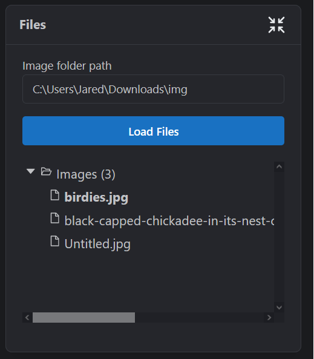
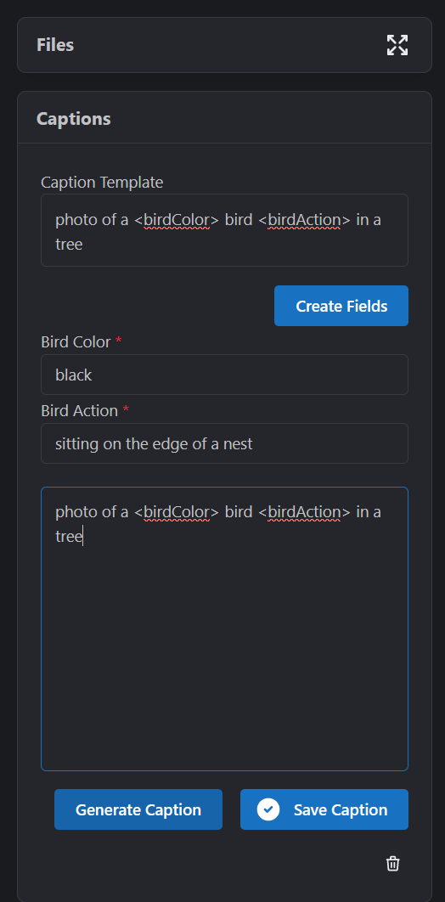
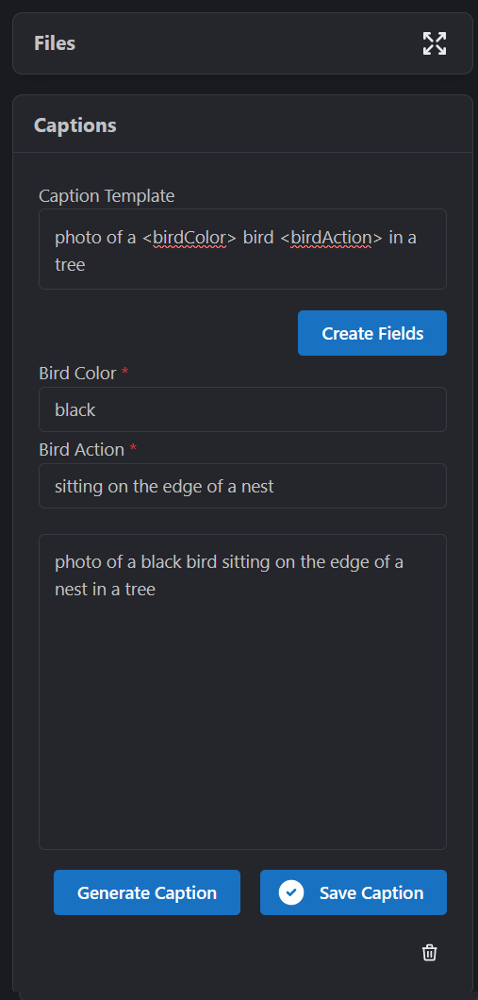

# 
Caption Captain 😎

An easy-to-use template-based captioning utility you can run with nodejs.

# Dependencies

- NodeJS 18+

# Installation

1. Run `git clone https://github.com/jndietz/caption-captain.git`
1. `cd <your-checkout-directory>\caption-captain`
1. `npm run start`
1. Navigate your browser to `http://localhost:1337`.

# Caption Templating

Template fields are wrapped in angle brackets `<>`. An example caption may be something like:

> `a <drawingType> of a <animalType> sitting on a <chairType> eating a piece of <foodType>`.

1. Load your images

2. Type in a caption template then click create fields.

3. Fill in the fields as desired, then click on "Save Caption"

# Do I have to use template-based captions?

Nope!  You can type whatever you want into the caption output text field and it will save.